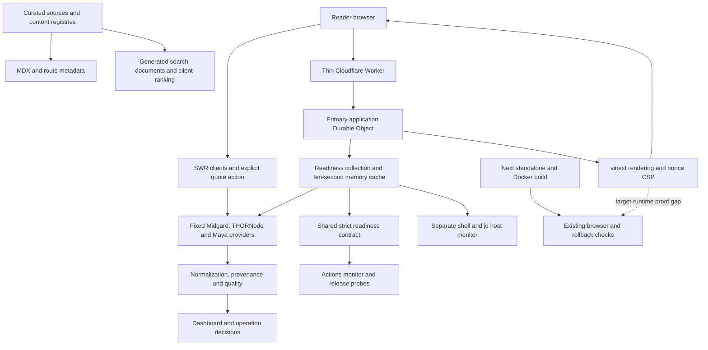
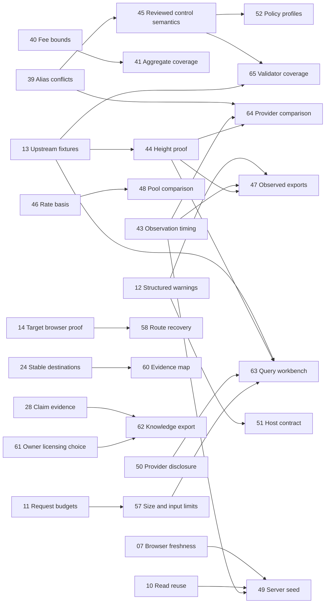

# THORChain Wiki — deeper improvement discovery, run 2

Reviewed 1 October 2026. **Proposed future PRs — concept/design only. Not implemented.**

This supplements the [first 36 proposals](/Users/reidar/Projectos/thorchain-wiki/docs/proposals/2026-10-01-improvement-portfolio.md). Its original briefs are retained; both reports now include publication records. This run adds **30 distinct proposals, PR-37–66**, plus refinements to earlier briefs. The combined portfolio contains 66 selectable proposals, not a commitment to implement all of them. On 1 October 2026 the owner approved publishing PR-37–66 as concept-only GitHub issues; these are now #136–#165. PR-01–36 were subsequently published as #166–#201; all 66 proposals are now issues. Publication does not authorize implementation.

## Assessment and operating model

The project's strongest asset is its distinction between explanation, dated source evidence, operational diagnostics, and transaction proof. It already has useful data clients, explicit source/degraded states, curated registries, reading paths, explorer filters, searchable content and serious release checks. The next challenge is to make those distinctions survive every transformation: response normalization, aggregation, time selection, display labels, browser recovery and operational validation.

This review goes deeper than the first pass in four ways:

1. Tests relations between datasets and layers, rather than inspecting only individual functions: conflicting control keys, duplicate intervals, contradictory quote/control evidence, fee bounds versus labels, and host versus application validation.
2. Inspects supporting tooling as executable behavior: automatic cleanup, trackedness, build freshness, separate script/app policies, and duplicated runtime contracts.
3. Checks more domain semantics against current primary sources, including fee cohorts, reported rate periods and a concrete contradiction between two liquidity articles.
4. Explores bounded product capabilities that reuse existing evidence: observed-snapshot exports, pool comparison, query recipes, provider comparison and validator-set coverage.

The material findings are boundary defects and missing proof, not a need for a new framework. Preserve the existing registries, SWR, BigInt accounting, native inputs/details, fail-closed readiness and immutable deployments. Add complexity only where a specific accepted proposal needs it.

### Current architecture and the important boundaries



The DO binding is SQLite-capable but the inspected entry has no history-storage calls. Browser data fetching and server readiness fetching are separate paths. The diagram describes the inspected current-main source and public runtime identity; it does not establish control-plane routing, request cost or sustained availability.

## Fresh state and evidence discipline

| Observation | Receipt and limitation |
|---|---|
| Local checkout | main at `798e34428882601781f0c0cf045cd7be7286b249`, with authored WIP; 26 opening file hashes include the first proposal document |
| GitHub main | Fresh API read returned `af210071b3110621ca9a83757697f12d103baae2`; current-main Cloudflare source inspected in the existing linked checkout |
| Duplicate check | Same ten all-state closed readiness alerts; six open dependency PRs [#130](https://github.com/Reedtrullz/tcwiki/pull/130), [#131](https://github.com/Reedtrullz/tcwiki/pull/131), [#132](https://github.com/Reedtrullz/tcwiki/pull/132), [#133](https://github.com/Reedtrullz/tcwiki/pull/133), [#134](https://github.com/Reedtrullz/tcwiki/pull/134), [#135](https://github.com/Reedtrullz/tcwiki/pull/135); all 36 earlier proposals reviewed for overlap |
| Current operations | Latest returned monitor [36832728969](https://github.com/Reedtrullz/tcwiki/actions/runs/36832728969) succeeded; the returned dependency-branch CI runs failed. This is not a new exact-main full-build receipt |
| Public readback | At 10:01 UTC, `/api/version` reported main's exact SHA, strict/verified runtime, and `cloudflare-worker@sha256:4bb45f28f9ed185b15b7751013b39da5c4f030ee56f291259f977b300270c143`; version, fee and stats routes returned 200 |
| CSP | Public fee/stats responses had enforced nonce CSP and no-store HTML. A proposal to turn on CSP was rejected as duplicate/already implemented |
| Fee page | Settled live page had no source warnings, 56 records/pair histories, 367 sealed samples and 67 epochs in one observation. Those are changing observations, not a coverage or causal-performance certification |
| Live interaction | Clicking the fee TOC's Controller config link changed the hash, left the target details closed, and placed its summary near viewport top under the fixed header |
| Additional tests | 103 tests in 12 focused suites passed on installed Vitest 4.1.11; main's lockfile differs. No install or clean-main build performed |
| Release trackedness | Existing check passed with 39 referenced scripts/specs; its scope excludes important new Cloudflare inputs |
| Disk | 43 GiB available before the additional suites; no builds/Docker loops |

**Labels:** Demonstrated = a synthetic or isolated runnable check reproduced current behavior; Observed = this live interaction/readback; Inspected = directly in source; Hypothesis = an unmeasured consequence; Idea/Stretch = proposed capability. Tests that accept current behavior do not certify domain truth. No production financial loss, exploit, provider dishonesty, outage or performance bottleneck is asserted.

Most new domain/tooling findings were compared with main. In the inspected THORNode diff, main adds configurable snapshot lag, while local latest-height lag is one block. The relevant alias/config/quote decision logic remains the same. Main's Cloudflare files are referenced from its existing linked checkout; they are absent from this old primary checkout.

## Cross-layer findings and recommended sequence

| Wave | Proposals | Why this order |
|---|---|---|
| Existing work first | Dependency PRs and September 30 content WIP | Restore the audited dependency gate and retain authored source work; no duplicate patch proposal |
| Small concrete corrections | 37, 38, 39, 40, 42, 51, 59 | Prevent filename deletion, wrong interval interpretation, silent control conflicts, misleading fee bounds, contradictory availability, weak host validation and contradictory liquidity copy |
| Evidence foundations | 41, 43, 44, 45, 46, 52, 53, 54, 55, 57 | Establish coverage, observation timing, pinning proof, version applicability, reported-rate meaning and reliable tooling boundaries |
| Reader/recovery improvements | 49, 50, 58, 66; earlier 19–25 | Make initial evidence, provider disclosure, failures and in-page navigation usable |
| Maintenance simplification | 56; earlier 27–32 | Remove unused scope after consumer checks and improve editorial sustainability |
| Optional product pilots | 47, 48, 60, 61, 62, 63, 64, 65 | Choose by user need and maintenance ownership; licensing policy precedes redistributed knowledge exports |

P1 means high-value correction/foundation; P2 means follow-up; P3 means optional. Scope S/M/L is comparative, not an estimate of calendar delivery. Dependencies name stable portfolio IDs across both documents; coordination notes are not hard prerequisites.

## F. Domain correctness across datasets

### PR-37 — Make platform cleanup inspectable and preserve authored files

**Classification:** Developer Safety / Foundation; P1; S. **Evidence:** Demonstrated. [cleanup](/Users/reidar/Projectos/thorchain-wiki/scripts/clean-platform-artifacts.mjs:7), [npm pretest hook](/Users/reidar/Projectos/thorchain-wiki/package.json). An authored scratch `content/proposal (1).md` was deleted based only on its name.

**Problem:** `pretest:unit` silently removes every matching numbered filename under content/docs/scripts/src/tests, without comparing contents or checking Git ownership. A Finder-style name is not proof of a disposable duplicate.

**Proposed PR:** Make ordinary tests non-destructive. Report candidate numbered files; use an explicit cleanup action only for reviewed, identical, untracked duplicates. Retain narrowly recognized OS metadata cleanup if needed.

**Scope boundaries:** No workspace cleanup in this mission; do not delete authored, changed or tracked files, recurse into unrelated trees, or add a cleanup framework.

**Acceptance target:** Isolated fixtures prove tracked files, nonidentical authored copies and untracked WIP survive the normal test command. Dry-run output names exact candidates; explicit removal is limited to reviewed identical duplicates.

**Dependencies:** None.

### PR-38 — Normalize earnings chronology and interval identity before aggregation

**Classification:** Correctness / Analytics; P1; S–M. **Evidence:** Demonstrated. [earnings rows](/Users/reidar/Projectos/thorchain-wiki/src/lib/stats-dashboard.ts:377), [history parser](/Users/reidar/Projectos/thorchain-wiki/src/lib/api/midgard.ts:544), [table](/Users/reidar/Projectos/thorchain-wiki/src/components/features/StatsEarningsTable.tsx). Shuffled start times 300/100/200 put 200 first; two copies of one 1-RUNE interval sum to 2.

**Problem:** Reversing provider order does not establish newest-first chronology. Index-based IDs conceal duplicate interval identity; seven rows need not mean seven distinct days. Date labels depend on local timezone and permissive parsing in the presentation helper.

**Proposed PR:** Retain validated start/end timestamps, sort by time, detect duplicates/overlaps and missing periods, and label UTC boundaries explicitly. Separate chronological chart order from newest-first recent rows. State loaded/completed period coverage.

**Scope boundaries:** This is earnings history; PR-04 owns swap-volume periods. Reuse its accepted interval principles without building a generic timeseries library.

**Acceptance target:** Permuting a valid response preserves totals/window selection; duplicate/conflicting intervals cannot inflate totals; boundary, gap, rollover and timezone fixtures preserve explicit period labels. Existing partial-total warnings remain.

**Dependencies:** Coordinate with PR-04; no hard prerequisite.

### PR-39 — Reject conflicting canonical Mimir key aliases

**Classification:** Core Reliability / Trust Boundary; P1; S. **Evidence:** Demonstrated. [canonical lookup](/Users/reidar/Projectos/thorchain-wiki/src/lib/api/thornode.ts:1782). `{HALTTRADING:0, halttrading:1}` reports `tradingPaused=false` with no source warning.

**Problem:** Case-insensitive lookup prefers an exact spelling or the first match. Conflicting aliases can therefore silently select one meaning. Existing malformed-value checks do not detect canonical-key collisions.

**Proposed PR:** Canonicalize once at the response boundary, retain original spellings, detect collisions, and reject or mark conflicting values unknown before deriving controls. Define whether identical aliases are tolerated and disclosed.

**Scope boundaries:** No new meaning for unknown controls; retain scoped-key parsing and readiness warning rules. A synthetic provider-shape defect is not proof it has occurred on mainnet.

**Acceptance target:** Input insertion order and capitalization cannot change a clean control decision. Conflicts produce actionable provenance and conservative availability/readiness; identical aliases have deterministic behavior.

**Dependencies:** Coordinate with PR-12; conflict detection can ship independently using current warning structures.

### PR-40 — Validate fee configuration relationships and bounds labels

**Classification:** Correctness / Fee Analytics; P1; S–M. **Evidence:** Demonstrated. [config](/Users/reidar/Projectos/thorchain-wiki/src/lib/api/thornode.ts:1163), [bounds helper](/Users/reidar/Projectos/thorchain-wiki/src/lib/data/dynamic-fees-helpers.ts:313), [history cards](/Users/reidar/Projectos/thorchain-wiki/src/components/features/DynamicFeePanels.tsx:620). A 25-bps record matches the inside filter for bounds 1–20; floor 20, ceiling 1 and epoch length zero produce no warning with empty records.

**Problem:** Individual nonnegative values do not establish a valid configuration. Equality-only bounds classification labels values outside bounds as inside; another card also defaults to inside when bounds are absent.

**Proposed PR:** Validate relationships and required positive values using reviewed protocol rules; distinguish below/inside/above/equal/unknown/invalid configuration. Reuse one classification for filters, distribution and pair cards.

**Scope boundaries:** Do not clamp silently, infer an active fee from a malformed configuration, or choose defaults from an unversioned document without review.

**Acceptance target:** Inverted/missing/equal bounds, zero epoch length, out-of-range records and clamp cases have explicit states; no invalid value matches Inside bounds. Known valid source fixtures retain exact raw/effective values.

**Dependencies:** None; coordinate with PR-45 for versioned policy.

### PR-41 — Expose fee-history cohorts and field-level aggregate coverage

**Classification:** Analytics / Trust UX; P1; M. **Evidence:** Demonstrated/inspected. [epoch aggregation](/Users/reidar/Projectos/thorchain-wiki/src/lib/data/dynamic-fees-helpers.ts:187), [headline signals](/Users/reidar/Projectos/thorchain-wiki/src/components/features/DynamicFeePanels.tsx:125). Two samples, one missing fees, yield a 1-TOR fee sum without a fee-validity count and an unweighted 10.5-bps controller average.

**Problem:** A changing set of thornames/pairs can make epoch totals incomparable. Samples, fee-valid samples and volume-valid samples differ. Stored controller floors are not the same measurement as effective fees divided by volume; multi-affiliate attribution also needs a precise summation boundary.

**Proposed PR:** Show cohort membership, missing-field counts and retention gaps; label sums as attributed stored samples, and label controller-floor means explicitly. Offer a comparable-cohort view before interpreting trends; define deduplication and any effective-rate metric from reviewed attribution semantics.

**Scope boundaries:** No causal revenue-lift claim, reconstruction of missing epochs or assumption that attributed totals equal unique protocol revenue. PR-35 owns durable historical storage.

**Acceptance target:** Partial fields and changing cohorts remain visible; duplicate attribution cannot silently become unique-revenue proof; controller mean and any computed effective fee ratio have different names/units. Unequal-volume fixtures expose their difference.

**Dependencies:** PR-40; coordinate with PR-13 for real schema fixtures.

### PR-42 — Reconcile quotes with later or contradictory operation evidence

**Classification:** Correctness / Core UX; P1; M. **Evidence:** Demonstrated. [route decision](/Users/reidar/Projectos/thorchain-wiki/src/lib/network-diagnostics.ts:299), [quote UI](/Users/reidar/Projectos/thorchain-wiki/src/components/features/NetworkStatusBanner.tsx). A matching successful quote causes Available even alongside an active HALTTRADING snapshot.

**Problem:** The quote branch returns before considering diagnostics. Quote issuance and operational observation are asynchronous; a still-unexpired quote can precede a new halt or come from a disagreeing provider.

**Proposed PR:** Preserve both findings, their provider/time context and the contradiction. Say that a quote was returned while current controls limit or cannot confirm execution; require explicit recheck after a material state change. Establish precedence using evidence time and scope.

**Scope boundaries:** Do not make diagnostics prove settlement, hide the quote body, or auto-submit transactions. Expiration is separately owned by PR-06.

**Acceptance target:** A later blocker prevents an unconditional positive availability claim; unrelated controls do not block the pair. Same-time provider disagreement, diagnostics failure and input changes retain all evidence and stay conservative.

**Dependencies:** PR-06; PR-43 supplies better timing evidence for the full reconciliation.

### PR-43 — Record collection timing and evaluate age at the decision boundary

**Classification:** Reliability / Evidence Foundation; P1; M. **Evidence:** Inspected. [collector start time](/Users/reidar/Projectos/thorchain-wiki/src/lib/api/thornode.ts:3153), [computed age](/Users/reidar/Projectos/thorchain-wiki/src/lib/api/thornode.ts:3170), [readiness cache](/Users/reidar/Projectos/thorchain-wiki/src/lib/readiness-snapshot.ts). THORNode checkedAt is captured before provider attempts; age is calculated before additional reads/history and cache TTL begins after collection.

**Problem:** A pre-request timestamp and precomputed block age can be older than their displayed interpretation by the time a long collection finishes. This differs from PR-07's browser-resume states: the data needs accurate timing before it reaches SWR.

**Proposed PR:** Record startedAt/completedAt, block observation time and duration; define checkedAt precisely. Recompute age when returning cached evidence and when making readiness/availability decisions, with explicit clock-skew handling.

**Scope boundaries:** No universal TTL, clock synchronization service or weakening of stale-data limits. Preserve request budgets from PR-11.

**Acceptance target:** Fake-clock tests include a slow first provider, fallback, history delay, cached return and negative age. A block that became too old during collection cannot be described by its earlier age as fresh.

**Dependencies:** Coordinate with PR-07 and PR-11; each can ship a bounded part independently.

### PR-44 — Distinguish requested height from verified response height

**Classification:** Evidence Foundation / Integration Reliability; P1; M. **Evidence:** Inspected. [fee freshness](/Users/reidar/Projectos/thorchain-wiki/src/lib/api/thornode.ts:3183), [exact-source URL assertions](/Users/reidar/Projectos/thorchain-wiki/scripts/lib/readiness-contract.mjs), [RUNEPool fetch](/Users/reidar/Projectos/thorchain-wiki/src/lib/api/thornode.ts). Fee/POL `snapshotPinned=true` records request construction; their parsers do not establish response-height echo.

**Problem:** Sending `?height=` and listing that URL proves a requested pin. It alone does not establish that every endpoint/provider honored that height. Network lastblock reconciliation supplies extra evidence; fee/POL paths have a narrower proof boundary.

**Proposed PR:** Model requestedHeight, observedHeight and pinning verification separately. Check documented headers/response evidence where available and add a bounded provider-capability test; otherwise label requested pinning accurately.

**Scope boundaries:** No accusation that current providers ignore height, extra arbitrary-height production sweeps, or mixing provider snapshots to manufacture agreement. Review endpoint capabilities before choosing a probe.

**Acceptance target:** Ignored/mismatched-height fixtures cannot produce Verified pinning; unsupported echo is explicitly unverified. Source URLs retain requested height and comparisons never conflate requested and observed values.

**Dependencies:** PR-13; coordinate with PR-10 and PR-43.

### PR-45 — Attach protocol applicability and activation rules to control definitions

**Classification:** Domain Architecture / Reliability; P2; M. **Evidence:** Inspected. [control catalog](/Users/reidar/Projectos/thorchain-wiki/src/lib/operational-controls.ts), [manual activation modes](/Users/reidar/Projectos/thorchain-wiki/src/lib/api/thornode.ts:2354), [fee defaults](/Users/reidar/Projectos/thorchain-wiki/src/lib/api/thornode.ts:1226). Labels/search metadata live centrally while activation modes/defaults are selected elsewhere; runtime version is mostly displayed.

**Problem:** A current runtime version does not currently select or disclose the reviewed rule set. Height-inclusive/exclusive, positive flags, absent defaults and experimental scope can diverge as the protocol changes.

**Proposed PR:** Extend the existing catalog only with the semantic fields actually consumed: activation mode, absence meaning, scope and reviewed source/version range. Start with controls already monitored; render an applicability warning for unsupported semantics rather than silently reuse a rule.

**Scope boundaries:** No generic rules engine, speculative version history, hard-coded guesses for every Mimir, or deriving code truth from a mutable develop ADR alone.

**Acceptance target:** Table-driven boundary tests cover before/at/after height, absent/invalid values and unsupported versions. Parser, display and search reference the same reviewed meaning; exact source revisions are reviewable.

**Dependencies:** PR-39; coordinate with PR-28 and PR-40.

### PR-46 — Preserve reported APR/APY basis and make the pool period explicit

**Classification:** Analytics Correctness / UX; P2; S–M. **Evidence:** Inspected. [pool normalization](/Users/reidar/Projectos/thorchain-wiki/src/lib/api/midgard.ts:420), [rate display](/Users/reidar/Projectos/thorchain-wiki/src/lib/stats-dashboard.ts), [primary API documentation](https://midgard.thorchain.network/v2/doc). The client collapses `poolAPY` and `annualPercentageRate` into one apyPercent; it does not request an explicit pool period. API docs describe a selectable extrapolation period and a 14d default.

**Problem:** A uniform APY label omits which field supplied it and the measurement interval. This can overstate comparability across provider fields or future period selection.

**Proposed PR:** Retain field identity, explicit requested period, scale and source. Label reported APR/APY according to reviewed API semantics; include the interval beside ranking and comparison controls.

**Scope boundaries:** No invented compounding conversion, future-return recommendation, or conflation with Maya's parser work in PR-03.

**Acceptance target:** APR-only, APY-only, both-present/disagreeing and missing fixtures preserve raw identity; rankings compare the same metric/basis. Period changes are bounded, shareable and reflected in cache keys/provenance.

**Dependencies:** Coordinate with PR-13; no hard prerequisite for truthful labels.

## G. Evidence workflows and reader capability

### PR-47 — Export the evidence actually observed in a live diagnostic

**Classification:** Product / Interoperability; P2; M. **Evidence:** Inspected/Idea. [existing source-map packet](/Users/reidar/Projectos/thorchain-wiki/src/lib/source-map-explorer.ts), [copy workflow](/Users/reidar/Projectos/thorchain-wiki/src/components/features/SourceMapExplorer.tsx:103), [network diagnostic](/Users/reidar/Projectos/thorchain-wiki/src/app/network/NetworkPageClient.tsx). Existing packets route readers to evidence and next checks; they do not capture a particular collected response.

**Problem:** A reader cannot reliably hand off the exact warning, source, observed time, height and units behind a live conclusion. A copied guidance packet and an observed snapshot answer different questions.

**Proposed PR:** Add an explicit export action for one bounded diagnostic snapshot as JSON and readable Markdown. Include schema version, requested/observed height, collection times, provider URLs, quality/warnings, units and runtime identity where actually known; label missing fields. Reuse current evidence types and the visible copy fallback.

**Scope boundaries:** Export only evidence already collected. No accounts, background recording, private address capture, transaction execution or implied provider attestation. This is separate from PR-23's printable authored articles.

**Acceptance target:** Partial, degraded, stale and unsupported-pinning exports match displayed evidence, preserve raw units and render safely when clipboard permission fails. Snapshot output is deterministic except explicit observation metadata; test schema compatibility and import as inert data.

**Dependencies:** PR-12, PR-43, PR-44 for a fully qualified export; a smaller pilot must label unsupported fields.

### PR-48 — Compare a bounded selection of pools on a consistent basis

**Classification:** Product / Analytics; P3; M. **Evidence:** Inspected/Idea. [pool explorer](/Users/reidar/Projectos/thorchain-wiki/src/components/features/StatsPoolExplorer.tsx), [row metrics](/Users/reidar/Projectos/thorchain-wiki/src/lib/stats-dashboard.ts), [existing detail client](/Users/reidar/Projectos/thorchain-wiki/src/lib/api/midgard.ts). Filtering and sorting exist; a small side-by-side evidence comparison does not.

**Problem:** Readers comparing two pools must remember values while changing filters. Missing metrics, differing rate bases and loaded-universe limits are easy to overlook.

**Proposed PR:** Select up to three already loaded pools and render an accessible comparison table with metric basis, period, source age, missing-value states and universe coverage. Encode selection in the existing URL-state pattern. Add detail requests only if a named comparison question needs them.

**Scope boundaries:** No portfolio optimizer, wallet connection, return forecast, asset recommendation or unconditional per-pool request fan-out.

**Acceptance target:** Same-basis comparisons remain understandable on narrow screens and by keyboard; missing metrics remain missing. Reload/back/forward restore selection, and ordinary comparison adds no provider requests.

**Dependencies:** PR-46; coordinate with PR-05, PR-08 and PR-13.

### PR-49 — Server-seed one bounded operational summary and provide a no-JavaScript path

**Classification:** Reliability / UX; P2; L. **Evidence:** Inspected/Idea. [server route](/Users/reidar/Projectos/thorchain-wiki/src/app/network/page.tsx), [client hooks and initial states](/Users/reidar/Projectos/thorchain-wiki/src/app/network/NetworkPageClient.tsx), [server collector](/Users/reidar/Projectos/thorchain-wiki/src/lib/readiness-snapshot.ts). The operational view starts with browser-driven live loading; server readiness is collected separately.

**Problem:** A reader with unavailable JavaScript or blocked provider requests can receive explanations without an initial operational summary. Separately collected server/client evidence also needs explicit replacement semantics.

**Proposed PR:** Pilot one bounded server summary using existing collectors, seed SWR with its timestamp/quality, and revalidate in the browser. Provide a clear static explanation/source path when collection fails or JavaScript is disabled.

**Scope boundaries:** Keep nonce CSP and dynamic/no-store HTML behavior. No personalized rendering, indefinite HTML snapshot cache, duplicated server transport or promise of faster loading without measurement.

**Acceptance target:** No-JavaScript and blocked-provider checks retain meaningful source-qualified information. Client refresh replaces seeded evidence coherently; stale seed cannot masquerade as fresh. Test collection deadlines, hydration, CSP and failure behavior against the actual Cloudflare candidate.

**Dependencies:** PR-07, PR-10, PR-43; coordinate verification with PR-14.

### PR-50 — Explain external-provider requests at the point of use

**Classification:** Privacy Transparency / UX; P2; S. **Evidence:** Inspected/Idea. [browser API requests](/Users/reidar/Projectos/thorchain-wiki/src/lib/api/thornode.ts), [quote action](/Users/reidar/Projectos/thorchain-wiki/src/app/network/NetworkPageClient.tsx), [source guidance](/Users/reidar/Projectos/thorchain-wiki/src/lib/source-map-explorer.ts). Live requests go directly from the reader's browser to named providers; quotes include the selected pair/amount.

**Problem:** Source provenance explains where answers came from, but a reader may not understand that providers receive the requested parameters and the browser's network request. This is a disclosure opportunity, not a demonstrated privacy violation.

**Proposed PR:** Add concise provider/request disclosure beside explicit quote and diagnostic actions, with a maintained list of request destinations and parameters. Keep quotes manual and explain what an exported packet contains.

**Scope boundaries:** No new tracking, request-history storage, silently introduced proxy, consent framework or legal conclusion. Existing referrer controls should be described accurately.

**Acceptance target:** Readers can identify destination, transmitted parameters and what stays local before requesting a quote. Copy matches actual client behavior, remains accessible and does not bury the primary action.

**Dependencies:** None; coordinate with PR-47 and PR-63.

## H. Release, monitoring and maintenance boundaries

### PR-51 — Align the independent host monitor with the strict readiness contract

**Classification:** Operations / Reliability; P1; S–M. **Evidence:** Demonstrated. [host monitor](/Users/reidar/Projectos/thorchain-wiki/scripts/check-production-readiness-host.sh:88), [shared validator](/Users/reidar/Projectos/thorchain-wiki/scripts/lib/readiness-contract.mjs), [host fixtures](/Users/reidar/Projectos/thorchain-wiki/tests/unit/host-readiness-monitor.test.ts). Its jq filter accepts ready=true, an invalid date/SHA, mutable image text and degraded sources; the shared validator rejects the same fixture.

**Problem:** Different consumers assign different meanings to a successful readiness body. The host check can bless a body that application/release validation considers incomplete.

**Proposed PR:** Validate the same required identity/source contract in the host path. Prefer a tiny wrapper around the existing shared validator if the host runtime supports it; otherwise maintain a deliberately equivalent jq check with shared positive/negative fixtures.

**Scope boundaries:** Preserve independent scheduling and network vantage. Do not weaken the strict contract, assume Node exists on the host, or infer that production is currently returning the synthetic malformed body.

**Acceptance target:** Both consumers reject missing/malformed identity, absent runtime and contradictions between ready and required source states/reasons. Both accept a valid body; alert formatting and nonzero failure exit remain intact. Timestamp parsing/age rules must be shared if strengthened with PR-43: the present shared validator only requires checkedAt to be a nonempty string, so this reproduction does not prove it independently rejects every malformed field.

**Dependencies:** PR-12 for any new warning fields; coordinate with PR-43 and PR-54.

### PR-52 — Make intentional script/app data-policy differences explicit

**Classification:** Architecture / Domain Reliability; P2; M. **Evidence:** Inspected. [independent snapshot script](/Users/reidar/Projectos/thorchain-wiki/scripts/lib/live-chain-snapshot.mjs), [application policies](/Users/reidar/Projectos/thorchain-wiki/src/lib/api/thornode.ts), [current-main configuration](/Users/reidar/Projectos/.codex-worktrees/cloudflare-thorchain-wiki/wrangler.jsonc). App lag is configurable on main; script lag is fixed. Provider lists and source-age limits have separate definitions.

**Problem:** A monitor and reader can evaluate different snapshots while sounding as if they applied the same policy. Some differences may be intentional; duplicated literals make that intent hard to audit.

**Proposed PR:** Name the actual supported policy profiles and document their differences. Share only truly common constants or reviewed control semantics through a small existing-compatible module; add a parity check for fields intended to match.

**Scope boundaries:** No universal configuration engine, forced equality between independent monitors, or refactor of every API client. Keep deliberate independence and bounded deadlines.

**Acceptance target:** Receipts disclose applied lag/age policy. Intentional differences have fixtures and rationale; unintended provider/default drift fails a narrow check. A configurable app lag is never reported as the script's fixed one-block policy.

**Dependencies:** PR-45 for reviewed control semantics; coordinate with PR-13.

### PR-53 — Extend release trackedness to the actual Cloudflare inputs

**Classification:** Release Foundation / Developer Experience; P1; S–M. **Evidence:** Inspected plus existing check. [trackedness graph](/Users/reidar/Projectos/thorchain-wiki/scripts/lib/release-tracked.mjs), [check entry](/Users/reidar/Projectos/thorchain-wiki/scripts/check-release-tracked.mjs), [current-main Worker/DO entry](/Users/reidar/Projectos/.codex-worktrees/cloudflare-thorchain-wiki/cloudflare/do-entry.mjs). The successful 39-reference check covers scripts/specs/systemd, with a restricted relative-import graph; important Cloudflare/config inputs are outside that proof.

**Problem:** Passing trackedness can be read as release-input completeness even though the newer target's entry/configuration/copy inputs are not represented.

**Proposed PR:** Add explicit Cloudflare release roots and the actual import/copy inputs consumed by its build. Fail when a release-required file is missing or untracked; list the checked scope in output. Reuse the existing walker where it fits.

**Scope boundaries:** Do not write a bundler, resolve every application module syntactically, or call this whole-artifact integrity. That is PR-15's separate boundary.

**Acceptance target:** Isolated tracked/untracked/missing fixtures cover Worker/app entry, runtime config and generated/copied release inputs. Check output names both target families and cannot pass solely on the old 39-script scope.

**Dependencies:** None; coordinate with PR-15.

### PR-54 — Reuse runtime identity validation or prove exact parity

**Classification:** Architecture / Verification; P2; S. **Evidence:** Inspected. [TypeScript validator](/Users/reidar/Projectos/thorchain-wiki/src/lib/runtime-metadata.ts), [script validator](/Users/reidar/Projectos/thorchain-wiki/scripts/lib/runtime-metadata-contract.mjs). Placeholder/version/commit/image rules are implemented in both, while readiness already imports a shared script contract.

**Problem:** Identical rules can drift on one side of a release boundary. The field verified also needs its actual meaning retained: validation of supplied identity shape is narrower than independent bundle attestation.

**Proposed PR:** Consume the existing small module from both environments with minimal typing, if compatible with both build targets. Otherwise use one shared fixture matrix that proves equivalent outcomes and explicitly documents verified's identity-validation meaning.

**Scope boundaries:** No validator framework, cryptographic attestation service or separate manifest design; PR-15 covers artifact identity.

**Acceptance target:** Both environments agree on valid digests, mutable references, placeholders, short/bad SHAs and missing values. Target builds pass without pulling server-only code into browser bundles; display cannot overstate self-reported metadata as independent attestation.

**Dependencies:** None; coordinate with PR-15 and PR-51.

### PR-55 — Fingerprint actual standalone build inputs instead of inferring freshness from mtimes

**Classification:** Developer Experience / Verification; P2; M. **Evidence:** Demonstrated. [freshness helper](/Users/reidar/Projectos/thorchain-wiki/scripts/lib/standalone-freshness.mjs:4). An isolated changed source file with preserved older mtime passes; a new proposal-only Markdown file makes the same fixture fail as stale.

**Problem:** The broad mtime scan both misses changed/deleted inputs and invalidates builds for files that do not affect the app. A timestamp comparison does not identify what was built.

**Proposed PR:** Record a deterministic content fingerprint of the actual standalone inputs at build time and compare it before serving that artifact. Exclude unrelated proposal/test documents; include generated app content, config and dependency lock inputs. Show changed/missing inputs in the failure message.

**Scope boundaries:** No automatic rebuild of dirty WIP, hashing node_modules, replacement of all build tooling or conflation with Cloudflare bundle identity in PR-15.

**Acceptance target:** Content change with preserved mtime, deletion, relevant config change and generated content change fail; unrelated proposal edits pass. Receipt matches the served build and absent receipts are reported explicitly.

**Dependencies:** None.

### PR-56 — Remove unused math dependencies and starter assets after consumer checks

**Classification:** Maintenance / Simplification; P2; S. **Evidence:** Inspected. [dependencies](/Users/reidar/Projectos/thorchain-wiki/package.json:47), [MDX configuration](/Users/reidar/Projectos/thorchain-wiki/next.config.ts), [public assets](/Users/reidar/Projectos/thorchain-wiki/public). Searches of src/content/config found no math-plugin use or starter-SVG references. Current formulas use authored text/code rather than this plugin pipeline.

**Problem:** Declared but unused math scope and framework starter assets add maintenance ambiguity. This is not measured bundle bloat: an unused dependency can remain absent from the client bundle.

**Proposed PR:** Reconfirm consumers on current main and remove only the unused direct math packages and unreferenced starter assets. Keep package/lockfile consistent and verify MDX rendering on both supported targets.

**Scope boundaries:** No math-rendering migration, removal of real illustrations, speculative API-helper deletion or churn across unrelated dependencies.

**Acceptance target:** Consumer search and representative formula/article rendering are recorded; no imports or asset URLs break, dependency lock is reproducible and both target checks pass. If a real consumer is found, preserve that item.

**Dependencies:** None; coordinate dependency updates with existing open PRs.

### PR-57 — Bound response parsing and request-input work at provider boundaries

**Classification:** Reliability / Security Hardening; P2; M. **Evidence:** Inspected/Hypothesis. [THORNode JSON transport and amount conversion](/Users/reidar/Projectos/thorchain-wiki/src/lib/api/thornode.ts), [Midgard JSON transport](/Users/reidar/Projectos/thorchain-wiki/src/lib/api/midgard.ts), [Maya client](/Users/reidar/Projectos/thorchain-wiki/src/lib/api/maya.ts). Timeouts exist; decoded response size/collection length are not generally bounded. Quote amount syntax validation does not impose an input-length ceiling before BigInt work.

**Problem:** A time budget alone does not bound parsing work or allocation. Very large but syntactically valid responses/amount strings are a hardening opportunity; no production abuse or memory exhaustion was demonstrated.

**Proposed PR:** Set documented, fixture-informed byte/row/digit limits at the smallest common transport/conversion boundary. Abort oversized reads before full parsing where the runtime supports streams; reject excessive quote input before numeric conversion. Reuse existing numeric-limit conventions.

**Scope boundaries:** No arbitrary low caps, truncation silently described as complete, new transport dependency, or generic threat platform.

**Acceptance target:** Over-limit streams, advertised/actual length mismatch, very large arrays and long numeric input fail with explicit warnings and bounded work. Normal recorded responses fit with documented headroom; provider failover/deadlines still work on both targets.

**Dependencies:** PR-11; coordinate fixtures with PR-13 and report ingestion with PR-18.

## I. Recovery, editorial correctness and knowledge reuse

### PR-58 — Add route recovery and a useful unmatched-route experience

**Classification:** Reliability / UX; P2; M. **Evidence:** Inspected/Idea. [app routes](/Users/reidar/Projectos/thorchain-wiki/src/app), [installed error convention](/Users/reidar/Projectos/thorchain-wiki/node_modules/next/dist/docs/01-app/03-api-reference/03-file-conventions/error.md), [installed not-found convention](/Users/reidar/Projectos/thorchain-wiki/node_modules/next/dist/docs/01-app/03-api-reference/03-file-conventions/not-found.md). No authored route error/not-found files were found. Ordinary provider failures already have component states; unexpected rendering failures are a separate boundary.

**Problem:** Unexpected component exceptions and unknown destinations lack project-specific recovery/source navigation. The framework default does not explain what remains usable in this wiki.

**Proposed PR:** Add the minimum supported route boundary and dark-theme unmatched-route view: retry affected content, retain meaningful navigation/source guidance, and offer existing search without automatic redirection. Verify the actual retry API for the chosen framework version/target; installed docs use retry, so do not assume an older signature.

**Scope boundaries:** No replacement of handled provider-error UI, exception details exposed to readers, new telemetry vendor or experimental global routing unless needed.

**Acceptance target:** A controlled rendering throw can recover without losing all navigation; keyboard focus and status announcements work. Unknown routes have useful links and correct target-specific response/indexing behavior, including streamed-response limitations. CSP remains enforced.

**Dependencies:** PR-14; coordinate accessibility with PR-21.

### PR-59 — Correct contradictory current-versus-historical ILP teaching copy

**Classification:** Editorial Correctness / Domain; P1; S. **Evidence:** Inspected and primary-source comparison. [CLP article](/Users/reidar/Projectos/thorchain-wiki/content/deep-dives/clp.mdx:49) says impermanent-loss protection can exceed fees and presents it as a risk mechanism; [liquidity actions](/Users/reidar/Projectos/thorchain-wiki/content/deep-dives/liquidity-actions.mdx:18) explicitly marks ILP as historical/removed. [Current official CLP documentation](https://docs.thorchain.org/technical-documentation/thorchain-finance/continuous-liquidity-pools) states removal under ADR-005, while retaining historical detail lower down.

**Problem:** Readers following two learning paths receive incompatible impressions of current protection. Merely linking an official page with historical sections does not resolve applicability.

**Proposed PR:** Correct the specific CLP risk paragraph; distinguish impermanent loss from historical protection, link the removal evidence and retain a clearly dated historical pointer if useful. Update the claim's review evidence and generated search together.

**Scope boundaries:** No bulk freshness repinning, personalized financial guidance or rewrite of all liquidity economics. Preserve existing authored content WIP.

**Acceptance target:** The two articles agree on current applicability and distinguish IL from ILP. A reviewed source revision/removal reference supports the correction; searches/snippets do not continue teaching current ILP protection.

**Dependencies:** None; coordinate the later claim model with PR-28.

### PR-60 — Add one annotated execution-and-evidence map to a learning path

**Classification:** Product / Education; P3; M. **Evidence:** Inspected/Idea. [CLP explanation](/Users/reidar/Projectos/thorchain-wiki/content/deep-dives/clp.mdx), [query/evidence guide](/Users/reidar/Projectos/thorchain-wiki/content/deep-dives/build-query-data.mdx), [content registry](/Users/reidar/Projectos/thorchain-wiki/src/lib/content/registry.ts). The inspected path explains lifecycle stages in prose; searches found no current Mermaid teaching map or referenced starter diagrams.

**Problem:** Readers must mentally connect quote, observation, signing, outbound and refund stages, and distinguish what each source can establish. A bounded authored map can teach these relationships without pretending to observe a transaction.

**Proposed PR:** Pilot one source-reviewed SVG/CSS diagram with an equivalent ordered text/table view and links to relevant anchored explanations. Mark evidence boundaries and possible failure/refund branches explicitly.

**Scope boundaries:** No diagram framework, animated execution claim, real transaction tracker (PR-33) or simulation engine (PR-34). Start with one maintained map.

**Acceptance target:** Keyboard/screen-reader users receive the same stages and caveats; narrow screens retain readable labels. Every semantic edge has reviewable source evidence and no green line implies a completed live transaction.

**Dependencies:** PR-24 for stable destinations; coordinate with PR-21 and PR-59.

### PR-61 — Record owner-approved licensing and attribution policy

**Classification:** Governance / Interoperability Foundation; P3; S. **Evidence:** Inspected/Idea. [repository root](/Users/reidar/Projectos/thorchain-wiki), [contribution guidance](/Users/reidar/Projectos/thorchain-wiki/CONTRIBUTING.md), [curated source records](/Users/reidar/Projectos/thorchain-wiki/src/lib/data/static.ts). Inventory found no LICENSE/NOTICE file establishing a redistribution policy for code and curated content.

**Problem:** A public repository and source attribution alone do not tell contributors/export consumers what the owner intends to permit. Machine-readable distribution needs a clear policy boundary.

**Proposed PR:** Prepare an inventory of original code/content versus externally attributed material; obtain the owner's explicit licensing choice and record scope, attribution and contribution expectations. Link the adopted policy from export/contribution surfaces.

**Scope boundaries:** Do not choose a license for the owner, infer rights to third-party/private content, copy full external articles or provide a legal determination. Metadata-only exports may be scoped separately after review.

**Acceptance target:** Owner decision is recorded; included material has identified provenance and redistribution scope, and any exclusions are visible. Repository/contribution/export wording agrees.

**Dependencies:** None; coordinate with PR-32.

### PR-62 — Export a versioned, curated knowledge graph as ordinary JSON

**Classification:** Advanced / Interoperability; P3; M–L. **Evidence:** Inspected/Idea. [content registry](/Users/reidar/Projectos/thorchain-wiki/src/lib/content/registry.ts), [curated records](/Users/reidar/Projectos/thorchain-wiki/src/lib/data/static.ts), [search registry](/Users/reidar/Projectos/thorchain-wiki/src/lib/search/registry.ts). Routes, terms, sources and reading relationships already exist in structured form.

**Problem:** Other documentation tools cannot reuse this curated structure through a stable, provenance-preserving data contract. Generated search data is optimized for the current UI rather than external reuse.

**Proposed PR:** Generate a bounded versioned JSON artifact for reviewed entities/relationships: stable IDs, route/title, source/confidence/review metadata, terminology and reading links. Include content/build identity and a checksum; start with one cohort covered by PR-28.

**Scope boundaries:** No graph database, CMS, hosted semantic service, automatically generated claims or full third-party text without the policy in PR-61. PR-31's human update feed remains a different output.

**Acceptance target:** Schema and compatibility are documented; every exported fact points to its evidence and unknown review state remains unknown. Generation is deterministic, stale/deleted links fail a narrow check, and consumers can inspect a sample without special infrastructure.

**Dependencies:** PR-28, PR-61; coordinate section IDs with PR-24 and updates with PR-31.

## J. Bounded advanced pilots

### PR-63 — Pilot an allowlisted, read-only API query recipe workbench

**Classification:** Stretch / Developer Product; P3; L. **Evidence:** Inspected/Stretch. [query teaching guide](/Users/reidar/Projectos/thorchain-wiki/content/deep-dives/build-query-data.mdx), [source-map packet](/Users/reidar/Projectos/thorchain-wiki/src/lib/source-map-explorer.ts), [fixed API helpers](/Users/reidar/Projectos/thorchain-wiki/src/lib/api/thornode.ts). Static request examples and quote diagnostics exist; a bounded raw-versus-normalized query teaching surface does not.

**Problem:** Builders need to understand how one real response becomes a source-qualified wiki conclusion. Static examples cannot expose the provider/version/height they actually observe.

**Proposed PR:** Pilot one existing recipe, such as a current control read: show the fixed URL, request once on explicit action, and display bounded raw/normalized evidence with units, height-verification limits, source quality and expiry. Reuse current transport/types.

**Scope boundaries:** No arbitrary URL fetcher, credentials, mutation endpoints, wallet/address/memo tooling, unattended polling or general API-console platform. Stop if a maintained static example answers the user need adequately.

**Acceptance target:** Only allowlisted requests are possible; size/deadline limits apply. Invalid/version-drift responses show useful warnings, copy exports remain inert, and the workbench never converts a requested height into verified pinning without evidence.

**Dependencies:** PR-13, PR-44, PR-50, PR-57.

### PR-64 — Compare two providers on explicit request without implying consensus

**Classification:** Stretch / Evidence Product; P3; M–L. **Evidence:** Inspected/Stretch. [failover clients](/Users/reidar/Projectos/thorchain-wiki/src/lib/api/thornode.ts), [independent snapshot check](/Users/reidar/Projectos/thorchain-wiki/scripts/lib/live-chain-snapshot.mjs). Current clients choose usable providers; independent operational reads exist, but reader-facing side-by-side evidence does not.

**Problem:** A diagnostic reader cannot tell whether a surprising value is shared across providers or reflects observation timing. First-usable failover deliberately answers availability rather than agreement.

**Proposed PR:** Add an opt-in comparison of two fixed providers for one bounded control dataset. Show timestamps/heights, field conflicts, missing data and semantic normalization; explain time skew and requested-height proof separately.

**Scope boundaries:** No automatic hedging of every poll, majority-vote truth, signed-consensus claim, persistent history service (PR-35) or production provider scoring without evidence.

**Acceptance target:** Equal, conflicting, unsupported-height, stale and unavailable fixtures remain distinguishable. Only explicit comparison adds the bounded second request; a newer sample is never mislabelled disagreement solely because it changed.

**Dependencies:** PR-39, PR-43, PR-44; coordinate with PR-13.

### PR-65 — Show THORChain validator-set and version coverage

**Classification:** Advanced / Network Product; P3; M. **Evidence:** Inspected/Idea. [existing node normalization and getNodes](/Users/reidar/Projectos/thorchain-wiki/src/lib/api/midgard.ts:226), [network summary](/Users/reidar/Projectos/thorchain-wiki/src/app/network/NetworkPageClient.tsx), [node normalization test](/Users/reidar/Projectos/thorchain-wiki/tests/unit/midgard.test.ts). THORChain has summary counts and an unused-by-UI node helper; Maya's separate panel already offers its own node visibility.

**Problem:** THORChain readers cannot inspect the coverage behind active-node/version summaries or distinguish missing node fields from homogeneous versions.

**Proposed PR:** Reuse the existing helper for a bounded THORChain node table and version distribution with status, missing-field coverage, source time and clearly reviewed semantics. Relate loaded rows to summary counts without asserting an unexplained mismatch is an outage.

**Scope boundaries:** No operator scoring, network-security guarantee, IP/contact enrichment, bond recommendation or replication of Maya-specific policy. Keep protocol interpretations reviewed and read-only.

**Acceptance target:** Partial/missing/unknown statuses and versions remain visible; totals describe the loaded universe. Numeric bounds, keyboard access, source degradation and version applicability pass recorded fixtures; no N-per-node polling.

**Dependencies:** PR-13, PR-45; coordinate with PR-08.

### PR-66 — Open collapsed dashboard destinations when readers navigate to them

**Classification:** UX / Accessibility; P2; S–M. **Evidence:** Observed/Inspected. [table of contents](/Users/reidar/Projectos/thorchain-wiki/src/components/layout/PageTableOfContents.tsx), [fee panel](/Users/reidar/Projectos/thorchain-wiki/src/app/dynamic-fees). On the public page, clicking Controller config sets `#dynamic-fee-controller-config` but its details remains closed and the summary lands near viewport top under the fixed header.

**Problem:** A successful hash change need not reveal the requested content. Conditional live targets and native collapsed details need navigation behavior beyond heading observation.

**Proposed PR:** On explicit hash navigation, reveal the target's necessary details ancestors, apply the existing header offset and preserve usable focus. Handle direct links, reload and history; explain unavailable conditional targets rather than silently claiming navigation succeeded.

**Scope boundaries:** Use native details/hash behavior and a small shared hook only if multiple consumers need it. No new scrolling library, forced opening of all panels, or replacement of PR-24's content heading IDs.

**Acceptance target:** Direct/reloaded/keyboard/TOC/back-forward destinations reveal the requested section below the header; loading, empty and error states retain meaningful fallback. Disclosure state remains reader-controlled outside explicit navigation.

**Dependencies:** None; coordinate with PR-21 and PR-24.

## Refinements to the first portfolio

These refine earlier acceptance targets; they are not extra proposal IDs and do not rewrite the first document.

| Earlier brief | Additional constraint from this run |
|---|---|
| PR-02 editorial exceptions | Make expired exceptions visible in normal CI output. An ignore-overdue mode can otherwise conceal which reviews need owner action; preserve the existing source-update WIP. |
| PR-06 quote expiry / PR-07 freshness | Expiry alone does not reconcile a later halt. Preserve quote issuance/provider and diagnostic timing; coordinate with 42/43 without making every browser recovery depend on every dataset migration. |
| PR-08 numeric limits | Include lexical numeric validation, not only magnitude: a synthetic USD value `0x10` currently displays as 16. A finite Number conversion is weaker than a documented decimal contract. |
| PR-10 collection reuse / PR-11 deadlines | Reuse only within the same provider/requested-height/policy context. Count history requests and collection delay when evaluating source age; retain separate retry behavior for rate limits. |
| PR-12 warning structure | Keep machine codes and severity authoritative. English wording must not decide whether a warning blocks readiness; alias conflicts/config errors need explicit semantic categories. |
| PR-13 upstream fixtures | Cover endpoint version/applicability, ordering/duplicate intervals, reported APR/APY field identity, unsupported height echo and conflicting aliases. Versioned fixtures remain compatibility evidence, not protocol truth. |
| PR-14/15 target and artifact proof | Add the input scope from 53 and identity parity from 54. A Worker identity field with a valid digest shape does not independently prove every uploaded module or routed control-plane setting. |
| PR-21 accessibility / PR-24 destinations | Add collapsed and conditional live targets from 66; a valid ID/hash need not reveal content. Keep article heading identity and live disclosure behavior separate. |
| PR-26 performance | Measure request counts and target CPU/latency before choosing server seeding, provider comparison or DO restructuring. Current live values are observations, not contention or cold-tail benchmarks. |
| PR-28 claim evidence | Pilot a contradictory current/historical claim such as ILP, rather than testing only two consistent paragraphs. Primary pages can retain historical sections or contain inconsistent defaults; applicability needs review. |
| PR-32 contribution templates | Include owner-approved redistribution/attribution policy if 61 is selected, and separate externally sourced claims from original explanatory copy. |
| PR-35 historical snapshots | Export/schema and observation metadata can be useful without persistent history. Do not introduce storage merely to support a one-time packet export or provider comparison. |

### Dependency map and practical selection

Hard prerequisites only are shown below. Coordination references in individual briefs are intentionally excluded, and no proposal depends on all 66.



PR-42 requires PR-06 for expiry integration; accurate temporal reconciliation benefits from PR-43, but the smaller contradiction guard can ship before that timing work. PR-44 itself uses PR-13. PR-62's PR-28 depends on PR-02. Earlier dependencies remain in the first report.

Recommended selection packages:

1. **Safety and truthful decisions:** 37, 38, 39, 40, 42, 51 and 59, alongside existing dependency fixes. Small focused changes come first; retain source/domain review for intended behavior.
2. **Proof that survives layers:** 12/13, 43/44, 45/46 and 53/54/55. Each closes a different proof boundary; do not fold these into a universal abstraction.
3. **Resilient reader experience:** existing 19–25 plus 50/58/66. Choose 49 only after target-runtime/deadline evidence shows the bounded server summary is worth its request cost.
4. **One useful product pilot:** choose 47 or 48 from actual reader demand; choose 60 for learning. Treat 62–65 as alternatives with explicit maintenance owners, rather than a default combined program.
5. **Historical capability only when needed:** keep 35 optional. It adds storage/retention operations that exported current evidence and manually requested provider comparisons do not require.

Before a future implementation, compare its touched files with the preserved WIP and current main. Do not merge incompatible assumptions from the old primary checkout and the Cloudflare-linked checkout.

## Complexity-only pass

This pass applied the Ponytail ladder separately from correctness/product discovery. Tags identify the smallest plausible approach, not a measured line-saving score.

- **[delete] PR-56:** remove unused math packages and unreferenced starter assets after current-main consumer checks; do not install a rendering pipeline to justify them.
- **[shrink] PR-37:** remove destructive cleanup from normal test execution; a candidate listing plus explicit reviewed cleanup is smaller and safer than a duplicate-file management subsystem.
- **[shrink] PR-54:** reuse the existing identity validator or share a fixture matrix; no new validation framework.
- **[native] PR-66:** reveal native details and use hash/scroll offset behavior; no scroll library.
- **[native] PR-60:** one authored accessible diagram and text equivalent; no diagram editor/runtime.
- **[stdlib] PR-47/62:** serialize existing typed records and use ordinary downloads; no graph database/export service.
- **[yagni] PR-35/63/64:** do not add persistence, a general API console or automatic provider fan-out until a selected pilot establishes a reader need.

A test-only legacy source-posture component and unused raw API helpers were considered for deletion. They were not promoted into a separate brief: migration of meaningful tests and potential consumers must be resolved first, and 65 may reuse the node helper. No net LOC, client-bundle reduction or speedup is claimed without an implementation/build measurement.

## Second-pass discovery and rejected directions

After the additional domain/tooling reproductions, I revisited the 36 earlier briefs and inspected lower-attention areas: node normalization, query teaching, snapshot handoff, source-map packets, licensing/distribution, route error conventions, math dependencies/assets, host-monitor fixtures and direct-to-provider browser behavior. This produced the bounded evidence/product pilots rather than repeated generic refactors.

Directions deliberately rejected or folded into existing proposals:

| Direction | Decision |
|---|---|
| Turn on CSP | Already enforced on the public readback; keep target-specific CSP proof in 14. |
| Replace SWR / add a generic transport framework | Existing clients and hooks support the proposed work; repair shared boundaries where useful. |
| Add wallets, signing, swaps, custody or personal portfolio advice | Outside the explanatory/read-only wiki's observed scope and introduces unrelated authorization/security obligations. |
| Add a CMS, authentication or graph database | No inspected persistence/editorial requirement justifies these. Existing typed registries are sufficient for the export pilot. |
| Add duplicate source URL-scheme validation | Curated-content validation already checks source URLs. |
| Automatically query all providers or record every poll | A bounded manual comparison is the narrower useful pilot; cost, retention and interpretation need evidence first. |
| Install/render math merely because dependencies exist | No inspected consumer requires the unused pipeline. Removal is the justified proposal. |
| Duplicate dependency security fixes | Open framework/dependency PRs already exist; retain cross-package coordination in 17. No exploit/reachability claim was added. |
| Invent current ILP coverage from historical official sections | Applicability conflict is an editorial correction with source review, not a license to generate new financial claims. |
| Add analytics or public error-reporting vendor | No measured incident/product question justifies it; route recovery can work without new tracking. |
| Treat valid metadata as migration completion | Public identity was refreshed; control-plane/origin-removal and sustained quota acceptance remain outside this run. |
| Add another broad “split oversized files” brief | Existing architecture proposal covers it; new briefs identify specific behavior/contract boundaries instead. |

The discovery pass stopped when remaining ideas mainly repeated these contracts, added speculative infrastructure, or required unobserved owner needs. Thirty additions are a curated portfolio, not a quota target.

## Coverage and limits

| Category | Additional inspected flow and resulting proposals |
|---|---|
| Product/onboarding | Source-map handoff, query guide, existing learning registries and live summaries → 47–50, 60, 62–65; earlier reading-path/onboarding ideas retained |
| UI/navigation/accessibility | Fee filters/history labels, pool explorer, live disclosure target, route failure conventions → 40/41/46/48/58/66 |
| Domain/core logic | Earnings chronology, canonical Mimir lookup, fee configuration/aggregation, quote-vs-control precedence, rate basis, ILP applicability → 38–46/59 |
| State/synchronization | Collection time, cache decision age, separately seeded browser/server evidence, requested vs observed heights → 42–44/49 |
| Architecture | Existing catalogs, app/script policy definitions, duplicate runtime validators and released input graph → 45/52–54 |
| Reliability/offline/degraded | Slow collection, partial aggregate fields, absent JS/providers, unexpected route exceptions and host acceptance → 41/43/49/51/57/58 |
| Performance/resources | Existing request timeouts, unbounded parse/input work, loaded-only comparison and explicit two-provider fan-out → 48/57/64; performance hypotheses remain unmeasured |
| Security/privacy | Direct provider destinations/parameters, input work ceilings, strict readiness identity, redistribution boundaries → 50/51/54/57/61; no fabricated exploit/privacy violation |
| Tests/developer experience | Test prehook execution in scratch, build-freshness fixtures, release graph, 12 focused suites, two-target error API documentation → 37/53/55/58 |
| Deployment/operations | Public exact-SHA/version/headers, fresh GitHub monitors/dependency PRs, host jq contract, current-main Worker/configuration → 51–54 |
| Documentation/editorial | Current/historical contradiction, authoritative ADR/API references, unused math pipeline, machine reuse/attribution → 45/46/56/59–62 |
| Storage/history | Inspected DO entry has no recording calls; evaluated export without persistence and kept earlier history proposal optional |
| Interoperability/power users | JSON/Markdown observed packets, period-qualified comparison, knowledge JSON, allowlisted query recipes → 47/48/62/63 |
| Recent history/issues/PRs | Refreshed main SHA, all-state issue inventory, six open dependency PRs and monitor/CI context; earlier 36 proposals deduplicated |

Specific limits:

- Source inspection is broad and targeted, not a claim that every line/all protocol versions were reviewed. The old dirty primary checkout and inspected current-main linked tree are distinguished above.
- The 103 additional passing tests use installed local dependencies. They are regression/structure evidence; new synthetic checks demonstrate gaps rather than certify the desired future semantics.
- No clean install, full unit run, production build, Docker build, complete E2E suite, profiler, load test or cold-tail CPU measurement was run in this additional pass.
- No real assistive-technology, physical-device, operator or financial-domain acceptance. Live browser navigation demonstrated one specific disclosure problem.
- No provider honesty/height-support allegation. Capability/response-height proof remains an implementation research task in 44.
- No Cloudflare control-plane, billing, production-origin retirement, host scheduler or VPS state mutation/audit in this pass.
- Primary-source review is specific, not a certification of every wiki claim. Mutable develop documentation and historical sections require version/applicability review.
- Discovery produced local drafts only. Publication was subsequently authorized: all 30 additions are now concept-only issues #136–#165, with exact title/body readback. No implementation PR exists.

## Runnable verification receipts

Run from `/Users/reidar/Projectos/thorchain-wiki` using the already installed dependencies. These checks deliberately assert **current behavior**, including undesirable behavior. They make the evidence reproducible; a future fix must invert the relevant assertion and supply domain-reviewed expected semantics. Scratch operations below occur only inside a bounded Python TemporaryDirectory.

### Domain and presentation: eight reproduction groups

```bash
node --input-type=module <<'TCWIKI_RECEIPT'
import assert from 'node:assert/strict';
import {createJiti} from 'jiti';
const j = createJiti(import.meta.url, {
  alias: {'@': process.cwd() + '/src'}, fsCache: false, moduleCache: false
});
const s = await j.import('./src/lib/stats-dashboard.ts');
const f = await j.import('./src/lib/data/dynamic-fees-helpers.ts');
const t = await j.import('./src/lib/api/thornode.ts');
const n = await j.import('./src/lib/network-diagnostics.ts');
const row = start => ({
  startTime: String(start), endTime: String(start + 100),
  earnings: '100000000', bondingEarnings: '50000000',
  liquidityEarnings: '50000000'
});
assert.equal(s.deriveStatsEarningsRows([row(300), row(100), row(200)])[0].id, '200-300-2');
assert.equal(s.deriveStatsEarningsCoverage(s.deriveStatsEarningsRows([row(100), row(100)]), false).totalEarnings, 2);
const record = {thorname:'sample',pair:'BTC.BTC|ETH.ETH',dynamicBps:25,whitelistState:'active',lastActiveEpoch:1};
assert.equal(f.filterDynamicFeeRecords([record], new Map(), {query:'',whitelist:'all',bps:'inside',current:'all'},1,20).length,1);
const inbound = ['BTC','ETH'].map(chain => ({
  chain, halted:false, global_trading_paused:false,
  chain_trading_paused:false, chain_lp_actions_paused:false
}));
const conflict = t.deriveNetworkStatus({HALTTRADING:0,halttrading:1},inbound,'3.19.2',100);
assert.equal(conflict.tradingPaused,false);
assert.equal(conflict.sourceWarnings.length,0);
const freshness = {checkedAt:'2026-10-01T10:00:00Z',thorchainHeight:100,thorchainBlockTime:'2026-10-01T10:00:00Z',thorchainBlockAgeSeconds:0,snapshotPinned:true};
const invalid = t.deriveDynamicL1FeeStatus({L1DYNAMICFEEFLOORBPS:20,L1DYNAMICFEECEILINGBPS:1,L1DYNAMICFEEEPOCHBLOCKS:0},{entries:[]},{epoch:1,entries:[]},freshness);
assert.equal(invalid.sourceWarnings.length,0);
assert.equal(s.deriveStatsPoolRows([{asset:'BTC.BTC',status:'available',runeDepth:'100000000',liquidityInUSD:'0x10',volume24h:'0'}])[0].liquidityUsd,16);
const epoch = f.historyEpochRows({histories:[{pairs:[
  {history:[{epoch:1,feesTorBaseUnits:'100000000',volumeTorBaseUnits:'100000000',bpsAtClose:1}]},
  {history:[{epoch:1,feesTorBaseUnits:null,volumeTorBaseUnits:'10000000000',bpsAtClose:20}]}
]}]})[0];
assert.equal(epoch.feesTor,1);
assert.equal(epoch.averageBps,10.5);
assert.equal(epoch.samples,2);
const halted = t.deriveNetworkStatus({HALTTRADING:1},inbound,'3.19.2',100);
assert.equal(halted.tradingPaused,true);
assert.equal(n.deriveRouteAvailability('BTC.BTC','ETH.ETH',halted,[],{
 request:{fromAsset:'BTC.BTC',toAsset:'ETH.ETH',amount:'1'},
 status:'available', summary:'Synthetic earlier quote',
 quote:{expiry:9999999999,expectedAmountOut:'1',fees:{},raw:{}}
}).status,'available');
console.log('8 domain/presentation reproduction groups passed; assertions record current gaps.');

TCWIKI_RECEIPT
```

### Tooling: four isolated reproduction groups

```bash
python3 <<'TCWIKI_RECEIPT'
import json, os, pathlib, subprocess, tempfile
root = pathlib.Path.cwd()
def node(code, *args, cwd=None):
    return subprocess.check_output(
        ['node','--input-type=module','-e',code,*args],
        text=True,cwd=cwd or root).strip()
with tempfile.TemporaryDirectory(prefix='tcwiki-discovery-') as d:
    p = pathlib.Path(d)
    authored = p/'content/proposal (1).md'
    authored.parent.mkdir(); authored.write_text('authored, not metadata')
    subprocess.run(['node',str(root/'scripts/clean-platform-artifacts.mjs')],cwd=d,check=True)
    assert not authored.exists()
    print('Cleanup removed authored numbered file in isolated fixture.')
    server = p/'.next/standalone/server.js'
    server.parent.mkdir(parents=True); server.write_text('// fixture')
    os.utime(server,(1000,1000))
    src = p/'src/sample.ts'; src.parent.mkdir()
    src.write_text('export const value=1'); os.utime(src,(500,500))
    code = 'import {checkStandaloneFreshness} from '+json.dumps(str(root/'scripts/lib/standalone-freshness.mjs'))+'; try {checkStandaloneFreshness(process.argv[1]); console.log("accepted")} catch(e) {console.log(e.message)}'
    assert node(code,d)=='accepted'
    src.write_text('export const value=2'); os.utime(src,(500,500))
    assert node(code,d)=='accepted'
    print('Changed source with preserved older mtime: accepted.')
    proposal = p/'docs/proposals/sample.md'; proposal.parent.mkdir(parents=True)
    proposal.write_text('proposal only'); os.utime(proposal,(1500,1500))
    assert 'Standalone build is stale: docs/proposals/sample.md' in node(code,d)
    print('New proposal with newer mtime: rejected as stale build.')
source = (root/'scripts/check-production-readiness-host.sh').read_text()
a=source.index('        def nonempty:')
b=source.index("\n      ' \"$body\"",a)
fixture={'status':'ready','ready':True,'checkedAt':'not-a-date','version':'x',
 'commit':'not-a-sha','image':'mutable:latest','reasons':[],
 'sources':{'midgard':{'status':'degraded'},'thornode':{'status':'degraded'}}}
host = subprocess.run(['jq','--arg','observedAt','2026-10-01T10:00:00Z',
 '--argjson','httpStatus','200',source[a:b]],input=json.dumps(fixture),text=True,capture_output=True,check=True)
assert json.loads(host.stdout)['readiness']['ready'] is True
code='import {assertReadinessContract} from '+json.dumps(str(root/'scripts/lib/readiness-contract.mjs'))+'; const value='+json.dumps(fixture)+'; try {assertReadinessContract(value); throw new Error("unexpected acceptance")} catch(e) {if(e.message!=="runtime must be an object") throw e; console.log(e.message)}'
assert node(code)=='runtime must be an object'
print('Host filter accepts malformed ready body; shared contract rejects it.')

TCWIKI_RECEIPT
```

### Additional regression checks

```bash
node node_modules/vitest/vitest.mjs run \
  tests/unit/stats-dashboard.test.ts \
  tests/unit/dynamic-fees-page.test.tsx \
  tests/unit/readiness-contract.test.ts \
  tests/unit/readiness-monitor.test.ts \
  tests/unit/host-readiness-monitor.test.ts \
  tests/unit/release-tracked.test.ts \
  tests/unit/standalone-freshness.test.ts \
  tests/unit/live-chain-snapshot.test.ts \
  tests/unit/site-discovery.test.ts \
  tests/unit/deep-dive-toc.test.ts \
  tests/unit/source-map-explorer.test.ts \
  tests/unit/ecosystem-directory.test.ts --maxWorkers=2
node scripts/check-release-tracked.mjs
```

Results: **12 suites / 103 tests passed**, approximately 7.24 seconds; release trackedness passed **39 referenced scripts/specs**. Direct Vitest invocation intentionally bypassed the destructive npm pretest cleanup. These suites are additional to the first report's 6 suites / 124 tests, with distinct suite paths; combined targeted coverage is 18 suites / 227 tests, not a full-suite or exact-main-lock proof.

### Preservation and non-actions

The second report is the only new repository file from this run. All 26 opening WIP/proposal file hashes were checked at completion; the first portfolio remains byte-identical. Obsidian logging is outside the repository.

No application source edits, bug fixes, dependency installation, refactor, implementation branch, commit, push, GitHub publication or deployment occurred. Read-only provider/public requests, browser navigation, GitHub inspection, local tests and isolated scratch fixtures were used. No subagents were spawned.

## GitHub publication — 1 October 2026

Published on explicit owner request after refreshing all-state issues, open PRs and main. No duplicates were found among the ten readiness-alert issues and six open dependency PRs. All 30 issues are OPEN; final titles/bodies were read back and matched the prepared public drafts. Local evidence links were converted to repository permalinks at af210071b3110621ca9a83757697f12d103baae2, with installed-only documentation identified explicitly. Links between these 30 proposals are resolved to actual issues; earlier IDs initially had titled unpublished references; the follow-up below resolves those to actual issues.

| Portfolio ID | GitHub issue | Title |
|---|---|---|
| PR-37 | [#136](https://github.com/Reedtrullz/tcwiki/issues/136) | Make platform cleanup inspectable and preserve authored files |
| PR-38 | [#137](https://github.com/Reedtrullz/tcwiki/issues/137) | Normalize earnings chronology and interval identity before aggregation |
| PR-39 | [#138](https://github.com/Reedtrullz/tcwiki/issues/138) | Reject conflicting canonical Mimir key aliases |
| PR-40 | [#139](https://github.com/Reedtrullz/tcwiki/issues/139) | Validate fee configuration relationships and bounds labels |
| PR-41 | [#140](https://github.com/Reedtrullz/tcwiki/issues/140) | Expose fee-history cohorts and field-level aggregate coverage |
| PR-42 | [#141](https://github.com/Reedtrullz/tcwiki/issues/141) | Reconcile quotes with later or contradictory operation evidence |
| PR-43 | [#142](https://github.com/Reedtrullz/tcwiki/issues/142) | Record collection timing and evaluate age at the decision boundary |
| PR-44 | [#143](https://github.com/Reedtrullz/tcwiki/issues/143) | Distinguish requested height from verified response height |
| PR-45 | [#144](https://github.com/Reedtrullz/tcwiki/issues/144) | Attach protocol applicability and activation rules to control definitions |
| PR-46 | [#145](https://github.com/Reedtrullz/tcwiki/issues/145) | Preserve reported APR/APY basis and make the pool period explicit |
| PR-47 | [#146](https://github.com/Reedtrullz/tcwiki/issues/146) | Export the evidence actually observed in a live diagnostic |
| PR-48 | [#147](https://github.com/Reedtrullz/tcwiki/issues/147) | Compare a bounded selection of pools on a consistent basis |
| PR-49 | [#148](https://github.com/Reedtrullz/tcwiki/issues/148) | Server-seed one bounded operational summary and provide a no-JavaScript path |
| PR-50 | [#149](https://github.com/Reedtrullz/tcwiki/issues/149) | Explain external-provider requests at the point of use |
| PR-51 | [#150](https://github.com/Reedtrullz/tcwiki/issues/150) | Align the independent host monitor with the strict readiness contract |
| PR-52 | [#151](https://github.com/Reedtrullz/tcwiki/issues/151) | Make intentional script/app data-policy differences explicit |
| PR-53 | [#152](https://github.com/Reedtrullz/tcwiki/issues/152) | Extend release trackedness to the actual Cloudflare inputs |
| PR-54 | [#153](https://github.com/Reedtrullz/tcwiki/issues/153) | Reuse runtime identity validation or prove exact parity |
| PR-55 | [#154](https://github.com/Reedtrullz/tcwiki/issues/154) | Fingerprint actual standalone build inputs instead of inferring freshness from mtimes |
| PR-56 | [#155](https://github.com/Reedtrullz/tcwiki/issues/155) | Remove unused math dependencies and starter assets after consumer checks |
| PR-57 | [#156](https://github.com/Reedtrullz/tcwiki/issues/156) | Bound response parsing and request-input work at provider boundaries |
| PR-58 | [#157](https://github.com/Reedtrullz/tcwiki/issues/157) | Add route recovery and a useful unmatched-route experience |
| PR-59 | [#158](https://github.com/Reedtrullz/tcwiki/issues/158) | Correct contradictory current-versus-historical ILP teaching copy |
| PR-60 | [#159](https://github.com/Reedtrullz/tcwiki/issues/159) | Add one annotated execution-and-evidence map to a learning path |
| PR-61 | [#160](https://github.com/Reedtrullz/tcwiki/issues/160) | Record owner-approved licensing and attribution policy |
| PR-62 | [#161](https://github.com/Reedtrullz/tcwiki/issues/161) | Export a versioned, curated knowledge graph as ordinary JSON |
| PR-63 | [#162](https://github.com/Reedtrullz/tcwiki/issues/162) | Pilot an allowlisted, read-only API query recipe workbench |
| PR-64 | [#163](https://github.com/Reedtrullz/tcwiki/issues/163) | Compare two providers on explicit request without implying consensus |
| PR-65 | [#164](https://github.com/Reedtrullz/tcwiki/issues/164) | Show THORChain validator-set and version coverage |
| PR-66 | [#165](https://github.com/Reedtrullz/tcwiki/issues/165) | Open collapsed dashboard destinations when readers navigate to them |

Exact public bodies, SHA-256 body hashes, issue URLs, readback flags and the duplicate-check inventory are saved in [the publication receipt](/Users/reidar/Projectos/thorchain-wiki/docs/proposals/2026-10-01-deeper-issue-publication.json). The source report hash records the pre-publication draft. Only this report and its receipt were updated for publication; earlier portfolio/WIP remains unchanged. No application implementation, branch, commit, push or deployment occurred.

## Earlier-proposal publication follow-up

On further explicit owner request, PR-01–36 were published as issues #166–#201. All 66 final issue titles, bodies, hashes, URLs and OPEN states were verified after resolving cross-portfolio prerequisite/coordination links. This supersedes the earlier unpublished-reference status. The original proposal briefs are unchanged; publication does not authorize implementation. See the [earlier report issue table](/Users/reidar/Projectos/thorchain-wiki/docs/proposals/2026-10-01-improvement-portfolio.md) and [earlier publication receipt](/Users/reidar/Projectos/thorchain-wiki/docs/proposals/2026-10-01-earlier-issue-publication.json).

## OP_RETURN roadmap follow-up — 2 October 2026

Owner-approved [OP_RETURN roadmap additions](2026-10-02-opreturn-roadmap.md) add PR-67–69 and refine existing PR-33 / #198 and PR-62 / #161. Priorities, scope, acceptance targets and verified issue links are in the follow-up. The portfolio now contains 69 distinct proposals; original issue-publication receipts remain historical. No application implementation or deployment.
